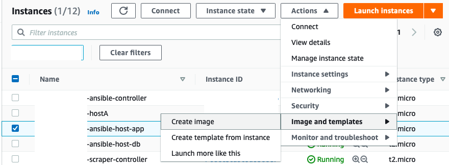
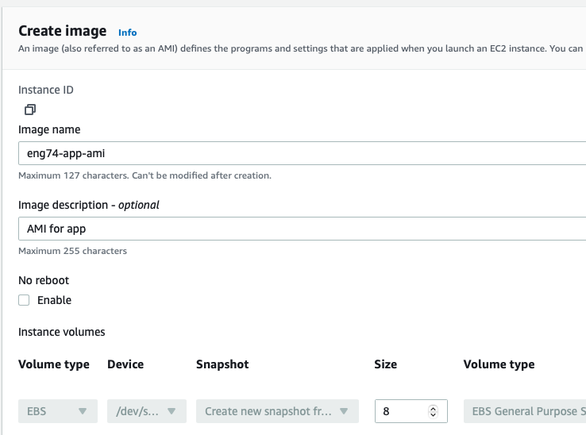

# Amazon Machine Images

## What is an AMI?
* Templates used to build a virtual machine
* Snapshot of a machine and it's data
* Comparable to a Vagrant virtual box. Both have an OS but AMI's also provide the state of machine - hard drive

## Creating an AMI
### Manual Method
1. Select the instance you wish to create an AMI of.
2. Click Actions --> Image and Templates --> Create Image.       
     
3. Give a name, description and click create.    
      

# Packer
* Open source tool
* Creates machine images for multiple platforms.
* Does not replace configuration management tools like Chef or Puppet, rather, it works in conjunction with them.
* Declared in a JSON file

## Installation and set-up
1. Connect to the controller instance
2. Install [Packer](https://learn.hashicorp.com/tutorials/packer/getting-started-install).
3. Navigate to home directory.
4. Create a new directory for packer files and within this directory, create a json file
```bash
mkdir packer_files
touch packer.json
```
5. Write the json file. An [example](https://learn.hashicorp.com/tutorials/packer/getting-started-build-image?in=packer/getting-started) file can be used as a guide but should be amended to reflect your configuration.  
```json
{
  "variables": {
    "aws_access_key": "{{env `AWS_ACCESS_KEY`}}",
    "aws_secret_key": "{{env `AWS_SECRET_KEY`}}"
  },
  "builders": [
    {
      "type": "amazon-ebs",
      "access_key": "{{user `aws_access_key`}}",
      "secret_key": "{{user `aws_secret_key`}}",
      "region": "eu-west-1",
      "source_ami_filter": {
        "filters": {
          "virtualization-type": "hvm",
          "name": "ubuntu/images/*ubuntu-bionic-18.04-amd64-server-*",
          "root-device-type": "ebs"
        },
        "owners": ["099720109477"],
        "most_recent": true
      },
      "instance_type": "t2.micro",
      "ssh_username": "ubuntu",
      "ami_name": "eng74-packer-ami-nodejs"
    }
  ],
}
```
6. Validate the json file using the following command
```bash
packer validate packer.json
```
7. Set up the environment variables and confirm the variables have been added to the environment using `printenv`
```bash
echo "export AWS_SECRET_KEY=xxxxxxxxxxxxxxx" >> ~/.bashrc
echo "export AWS_ACCESS_KEY=xxxxxxxxxxxxxxx">>~/.bashrc
source ~/.bashrc
```
8. Build the AMI
```
packer build packer.json
```
9. Navigate to the AWS management console and confirm the AMI has been created.

## Using an AMI
The newly created AMI can be validated by using it to create an instance.
1. Click 'launch instance' and select your newly created AMI. If needs be, filter by selecting 'My AMIs'.
2. Configure instance as per usual.
3. Connect to the instance.

## Provisioning
Ansible can be used in conjunction with packer to provision AMIs.
1. Connect to the controller instance and navigate to the playbooks directory.
2. Confirm the playbook is running as expected.
```bash
ansible-playbook --ask-vault-pass file.yml
```
3. Upon confirmation, amend the playbook file and set the host as default.
4. Navigate to the packer files directory and add the following commands to the json file
```JSON
"provisioners": [
  {
    "type": "ansible",
    "playbook_file": "/home/ubuntu/playbooks/app2.yaml"
  }
]
```
